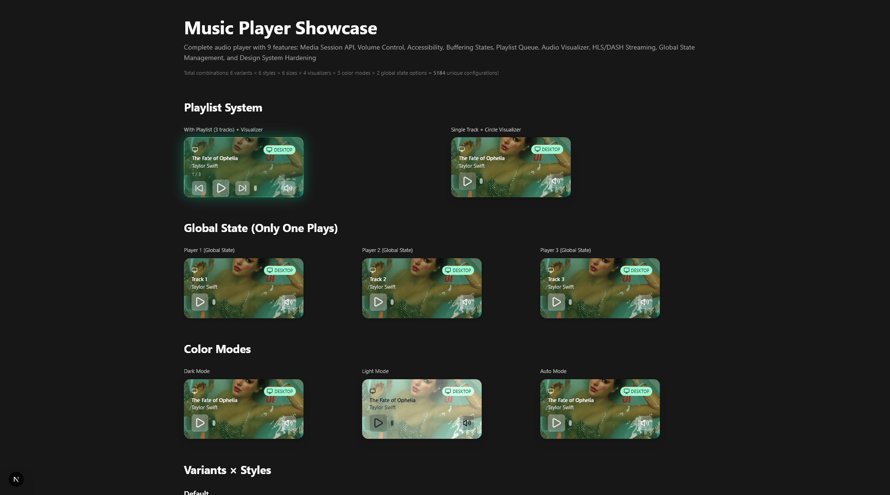

<div align='center'>

# Nolly Components

**A modern, production-ready React component library**

[](https://opensource.org/licenses/MIT)
[](https://www.typescriptlang.org/)
[](https://nextjs.org/)
[](https://tailwindcss.com/)

[Live Demo](https://thenolle.github.io/nolly-components) · [Report Bug](https://github.com/thenolle/nolly-components/issues) · [Request Component](https://github.com/thenolle/nolly-components/issues)

</div>

---

## Components

### Music Player
A complete, feature-rich audio player with 9 advanced features:

- **Media Session API**: Lock screen & headset controls
- **Volume Control**: Desktop hover slider + mute
- **Accessibility**: ARIA labels + reduced motion support
- **Buffering States**: Audio-driven loading indicators
- **Playlist Queue**: Auto-advance, shuffle, navigation
- **Audio Visualizer**: 3 types (bars, waveform, circle) powered by Web Audio API
- **HLS/DASH Streaming**: Live radio support with hls.js + Safari fallback
- **Global State**: Multi-instance sync via React Context
- **Design System**: Light/dark modes, 6 variants × 6 styles × 6 sizes = **1,296 combinations**

[View Music Player Demo](https://thenolle.github.io/nolly-components/music-player) · [Component Docs](#music-player-api)

---

## Installation

```bash
git clone https://github.com/thenolle/nolly-components.git

cd nolly-components

npm install
# or
yarn install
# or
pnpm install

npm run dev
# or
yarn dev
# or
pnpm dev
```

---

## Quick Start

Setup

Wrap your app with the global providers:
```tsx
// app/layout.tsx
import { AudioPlayerProvider } from 'nolly-components/contexts/AudioPlayerContext'

export default function RootLayout({ children }) {
  return (
    <html lang='en'>
      <body>
        <AudioPlayerProvider>
          {children}
        </AudioPlayerProvider>
      </body>
    </html>
  )
}
```

Music Player - Basic Usage
```tsx
import { MusicPlayer } from 'nolly-components/components/MusicPlayer'

export default function App() {
  return (
    <MusicPlayer
      trackName='Song Name'
      artist='Artist Name'
      cover='/cover.jpg'
      audioSrc='/song.mp3'
      variant='neon'
      visualizer='bars'
    />
  )
}
```

Music Player - With Playlist
```tsx
const playlist = [
  { id: '1', name: 'Track 1', artist: 'Artist A', cover: '/cover1.jpg', audioSrc: '/song1.mp3' },
  { id: '2', name: 'Track 2', artist: 'Artist B', cover: '/cover2.jpg', audioSrc: '/song2.mp3' },
  { id: '3', name: 'Track 3', artist: 'Artist C', cover: '/cover3.jpg', audioSrc: '/song3.mp3' }
]

<MusicPlayer
  trackName='Fallback'
  artist='Artist'
  cover='/fallback.jpg'
  playlist={playlist}
  currentTrackIndex={0}
  variant='glass'
  visualizer='circle'
  onTrackChange={(track, index) => console.log(`Now playing: ${track.name}`)}
/>
```

Music Player - Global State

Enable global state to sync multiple players (only one plays at a time):
```tsx
<MusicPlayer
  id='player-1'
  trackName='Song 1'
  artist='Artist'
  cover='/cover1.jpg'
  audioSrc='/song1.mp3'
  useGlobalState={true}
/>

<MusicPlayer
  id='player-2'
  trackName='Song 2'
  artist='Artist'
  cover='/cover2.jpg'
  audioSrc='/song2.mp3'
  useGlobalState={true}
/>
```

Music Player - HLS Streaming
```tsx
<MusicPlayer
  trackName='Live Radio'
  artist='Station FM'
  cover='/radio.jpg'
  audioSrc='https://example.com/stream.m3u8'
  variant='elevated'
  visualizer='bars'
/>
```

---

## Music Player API

### Props

| Prop              | Type                                                           | Default        | Description                                |
| ----------------- | -------------------------------------------------------------- | -------------- | ------------------------------------------ |
| trackName         | string                                                         | required       | Track title                                |
| artist            | string                                                         | required       | Artist name                                |
| cover             | string                                                         | required       | Cover image URL                            |
| audioSrc          | string                                                         | undefined      | Audio file URL (MP3, HLS .m3u8, DASH .mpd) |
| id                | string                                                         | auto-generated | Unique player ID (for global state)        |
| variant           | 'default' \| 'glass' \| 'minimal' \| 'neon' \| 'soft' \| 'elevated' | 'default'      | Visual variant                             |
| style             | 'filled' \| 'outline' \| 'ghost' \| 'soft' \| 'blur' \| 'flat' | 'filled'       | Style variant                              |
| size              | 'xs' \| 'sm' \| 'md' \| 'lg' \| 'xl' \| '2xl'                  | 'md'           | Component size                             |
| visualizer        | 'none' \| 'bars' \| 'waveform' \| 'circle'                     | 'none'         | Audio visualizer type                      |
| visualizerColor   | string                                                         | auto           | Custom visualizer color (CSS color)        |
| playlist          | Track[]                                                        | []             | Array of tracks for queue                  |
| currentTrackIndex | number                                                         | 0              | Starting track index in playlist           |
| colorMode         | 'light' \| 'dark' \| 'auto'                                    | 'auto'         | Color mode                                 |
| useGlobalState    | boolean                                                        | false          | Enable global state management             |
| reducedMotion     | boolean                                                        | false          | Disable animations for accessibility       |
| loading           | boolean                                                        | false          | External loading state                     |
| deviceLabel       | string                                                         | auto-detected  | Device label override                      |
| deviceType        | DeviceType                                                     | auto-detected  | Device type override                       |
| onPlayToggle      | (playing: boolean) => void                                     | undefined      | Play/pause callback                        |
| onTrackChange     | (track: Track, index: number) => void                          | undefined      | Track change callback                      |
| onNext            | () => void                                                     | undefined      | Next button callback                       |
| onPrevious        | () => void                                                     | undefined      | Previous button callback                   |
| onShuffle         | () => void                                                     | undefined      | Shuffle button callback                    |
| onAdd             | () => void                                                     | undefined      | Add button callback                        |
| className         | string                                                         | ''             | Additional CSS classes                     |

Track Type
```ts
type Track = {
  id: string
  name: string
  artist: string
  cover: string
  audioSrc?: string
}
```

#### Variants Gallery



---

## Project Structure

```
nolly-components/
├── app/
│   ├── globals.css                 # Global styles
│   ├── layout.tsx                  # Root layout with providers
│   ├── page.tsx                    # Home page
│   └── music-player/
│       └── page.tsx                # Music player showcase
├── components/
│   └── MusicPlayer.tsx             # Music player component
├── contexts/
│   └── AudioPlayerContext.tsx      # Global audio state management
├── lib/
│   └── utils.ts                    # Utility functions (cn, etc.)
├── .github/
│   ├── assets/
│   │   └── variants-gallery.png    # Variants gallery image
│   ├── workflows/
│   │   └── deploy.yml              # GitHub Pages auto-deploy
│   ├── ISSUE_TEMPLATE/
│   │   ├── bug_report.md
│   │   └── feature_request.md
│   └── PULL_REQUEST_TEMPLATE.md
├── next.config.ts                  # Next.js config (static export)
├── package.json
├── tsconfig.json
├── tailwind.config.ts
├── README.md
├── CONTRIBUTING.md
├── SECURITY.md
├── CODE_OF_CONDUCT.md
└── LICENSE
```

---

## Design Philosophy

Nolly Components follows these principles:
1. **Modular**: Each component is self-contained with minimal dependencies
2. **Accessible**: WCAG 2.1 AA compliant with ARIA labels and keyboard navigation
3. **Customizable**: Extensive prop APIs with design tokens
4. **TypeScript-first**: Fully typed with no any
5. **Zero-config**: Works out of the box with sensible defaults
6. **Lightweight**: Tree-shakeable with optimal bundle size

---

## Contributing

Contributions are welcome! Please read our [Contributing Guide](CONTRIBUTING.md) and [Code of Conduct](CODE_OF_CONDUCT.md).
1. Fork the repository
2. Create your feature branch (`git checkout -b feature/amazing-component`)
3. Commit your changes (`git commit -m 'Add amazing component'`)
4. Push to the branch (`git push origin feature/amazing-component`)
5. Open a Pull Request

---

## License

This project is licensed under the MIT License - see the [LICENSE](LICENSE) file for details.

---

## Acknowledgments

- Built with [Next.js 16](https://nextjs.org/)
- Styled with [Tailwind CSS 4](https://tailwindcss.com/)
- Icons by [Lucide](https://lucide.dev/)
- Streaming powered by [hls.js](https://github.com/video-dev/hls.js/)
- Audio visualization via [Web Audio API](https://developer.mozilla.org/en-US/docs/Web/API/Web_Audio_API)

---

## Statistics

- 
- 
- 

---

<div align='center'>

[Back to Top](#nolly-components)

Made with ❤️ by [Nolly](https://thenolle.com)

[Website](https://thenolle.com) · [GitHub](https://github.com/thenolle) · [Patreon](https://patreon.com/c/_nolly)

</div>